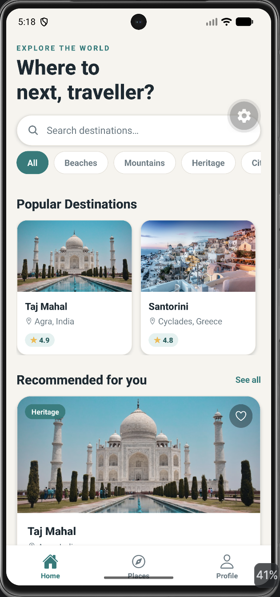
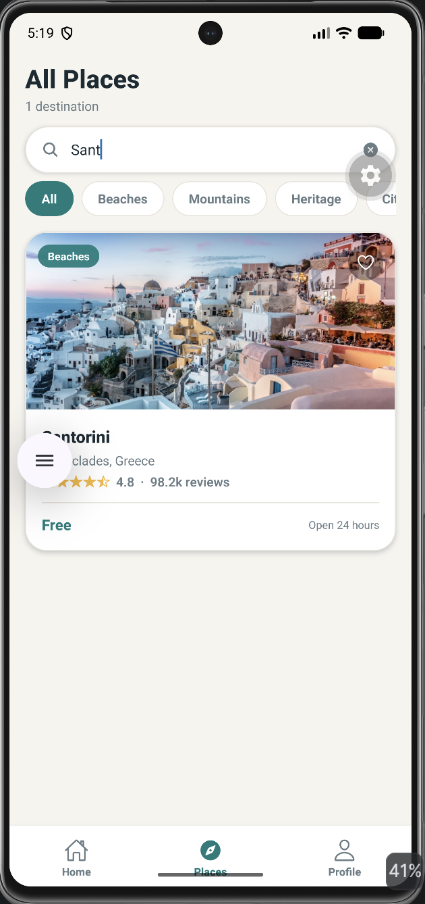
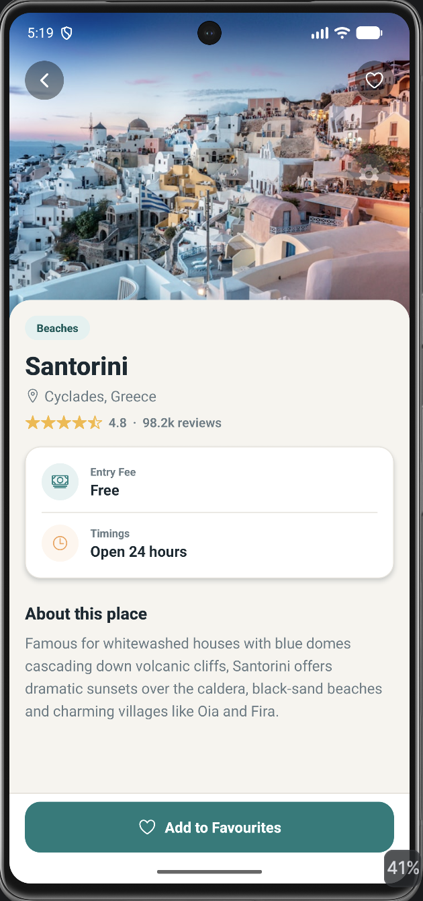
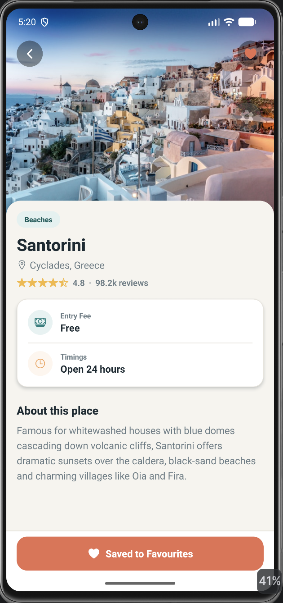
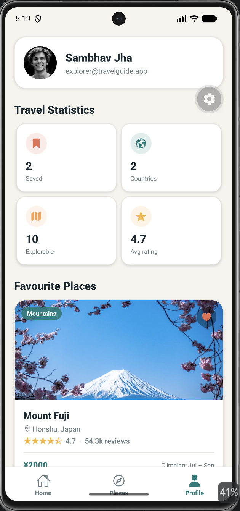

# Travel Guide 🌍

---

## Project Description

Travel Guide is a React Native mobile app I built as a college assignment. The idea was simple: make something that lets people explore popular travel destinations from their phone, without the interface getting in the way.

The app shows details for each destination — ratings, location, entry fees, timings, a short description and a photo. You can browse through the places, search for a specific one, filter them by category, open any place to read more, and save the ones you like so you can come back to them later.

To make it feel less like a class project and more like an actual app, I added a few extra things: favourites that stick around after you close the app (using AsyncStorage), pull-to-refresh, a smoother search that doesn't lag while you type, fallback handling for images that don't load, and error handling so the app doesn't just crash when something goes wrong.

The whole thing is built from reusable components, uses the Context API to manage state, and React Navigation to move between screens.

---

## Features

* Browse popular travel destinations
* Search destinations by name or location
* Filter destinations by category
* View detailed destination information
* Save and remove favourite destinations
* Persistent favourites using AsyncStorage
* Pull-to-refresh support
* Debounced search functionality
* Smart image loading with fallback support
* ErrorBoundary for application crash protection
* Responsive and modern UI
* Bottom Tab Navigation
* Stack Navigation for destination details
* Reusable component architecture
* Profile screen with travel statistics
* Empty state handling
* Accessibility improvements

---


---
## 📸 Application Screenshots

<table align="center">
<tr>
<td align="center">
<b>Home Screen</b><br><br>

</td>

<td align="center">
<b>Search Screen</b><br><br>

</td>
</tr>

<tr>
<td align="center">
<b>Place Details</b><br><br>

</td>

<td align="center">
<b> Favourite Places</b><br><br>

</td>
</tr>

<tr>
<td align="center" colspan="2">
<b>Profile Screen</b><br><br>

</td>
</tr>
</table>


## Installation Steps

### Requirements

* Node.js
* Expo CLI
* Expo Go Application OR Android Emulator

### Step 1 — Clone Repository

```bash
git clone https://github.com/Codechefskj/Travel-Guide.git
```

### Step 2 — Move Into Project Directory

```bash
cd Travel-Guide
```

### Step 3 — Install Dependencies

```bash
npm install
```

### Step 4 — Install Required Packages

```bash
npx expo install @react-native-async-storage/async-storage
npx expo install react-native-safe-area-context
npx expo install react-native-gesture-handler
npx expo install @expo/vector-icons
```

### Step 5 — Start Development Server

```bash
npx expo start
```

### Step 6 — Run Application

Option A — Scan QR code using Expo Go

Option B — Press A to open Android Emulator

---

## Project Structure

```text
Travel-Guide/
│
├── App.js
│
├── src
│   │
│   ├── components
│   │   ├── PlaceCard.js
│   │   ├── RatingStars.js
│   │   ├── SearchBar.js
│   │   ├── SmartImage.js
│   │   ├── ErrorBoundary.js
│   │   ├── SectionHeader.js
│   │   └── UIComponents.js
│   │
│   ├── context
│   │   └── FavoritesContext.js
│   │
│   ├── navigation
│   │   └── AppNavigator.js
│   │
│   ├── screens
│   │   ├── HomeScreen.js
│   │   ├── PlacesScreen.js
│   │   ├── PlaceDetailsScreen.js
│   │   └── ProfileScreen.js
│   │
│   ├── hooks
│   │   └── useDebouncedValue.js
│   │
│   ├── data
│   │   └── places.js
│   │
│   └── theme
│       └── theme.js
│
└── README.md
```

---

## Navigation Structure

The app uses both Stack Navigation and Bottom Tab Navigation together.

### Bottom Tabs

* Home
* Places
* Profile

### Stack Screens

* Tabs
* PlaceDetails

The bottom tabs handle the main sections, and the detail screen sits on top in a stack. So tapping a place slides you into its details, and the back button brings you straight out — the flow stays simple and predictable.

---

## State Management

I used the React Context API to keep track of favourite destinations across the whole app, so I didn't have to pass props down through every screen.

### Features

* Add destination to favourites
* Remove destination from favourites
* Access favourites from any screen
* Persistent storage using AsyncStorage
* Centralized state management

### Context Functions

| Function         | Description                           |
| ---------------- | ------------------------------------- |
| isFavorite()     | Checks whether a destination is saved |
| toggleFavorite() | Adds or removes favourites            |
| clearFavorites() | Clears saved destinations             |

---

## Data Persistence

Favourites are saved locally on the device with AsyncStorage, so they don't disappear when the app is closed.

### Benefits

* Data remains after application restart
* Better user experience
* Offline persistence
* Faster access to favourite destinations

### Workflow

```text
User Action
     │
     ▼
Favorites Context
     │
     ▼
AsyncStorage
     │
     ▼
Local Device Storage
     │
     ▼
Data Loaded On Next Launch
```

One thing I had to handle here was the loading order — the app needs to read the saved list before it writes anything back, otherwise it can wipe the saved data with an empty list on startup. A small "hydrated" flag takes care of that.

---

## Search Functionality

Search is handled with a custom debounce hook so it doesn't re-filter the list on every single keystroke.

### Benefits

* Prevents unnecessary filtering on every keystroke
* Improves application performance
* Smooth user experience
* Reduces re-renders

### Search Features

* Search by destination name
* Search by location
* Category filtering
* Real-time results

---

## Error Handling

I added a few different things to keep the app from breaking when something doesn't go to plan.

### SmartImage Component

* Handles broken image URLs
* Shows loading indicator while images load
* Displays fallback placeholder on failure

### ErrorBoundary

* Prevents complete application crashes
* Displays friendly error messages
* Allows application recovery

### Navigation Validation

* Handles missing destination data
* Prevents invalid screen navigation
* Provides fallback user interface

---

## User Interface Design

The design follows a clean, travel-themed look that's kept consistent through a shared styling system.

### Design Features

* Consistent color palette
* Reusable styling system
* Card-based layouts
* Responsive spacing
* Clean typography
* Soft shadows
* Modern destination cards

### Theme Configuration

All the styling values live in one theme file, covering:

* Colors
* Typography
* Spacing
* Border Radius
* Shadows

Keeping these in one place made the app easier to maintain and kept everything looking consistent across screens.

---

## Packages Used

| Package                                   | Purpose               |
| ----------------------------------------- | --------------------- |
| @react-navigation/native                  | Core navigation       |
| @react-navigation/native-stack            | Stack navigation      |
| @react-navigation/bottom-tabs             | Bottom tab navigation |
| react-native-safe-area-context            | Safe area support     |
| react-native-gesture-handler              | Gesture support       |
| @react-native-async-storage/async-storage | Persistent storage    |
| @expo/vector-icons                        | Application icons     |

---

## Challenges Faced During Development

### State Management

Keeping favourites in sync across multiple screens was tricky at first. I solved it by moving everything into a single Context provider instead of juggling state in each screen.

### Data Persistence

I wanted favourites to survive an app restart, which meant saving them somewhere. AsyncStorage handled this, though I had to sort out the loading-order issue I mentioned earlier.

### Search Optimization

Filtering on every keystroke made the search feel laggy. Adding a debounce hook fixed it and made typing feel smooth.

### Image Handling

Some of the remote images failed to load now and then, usually due to network or bad URLs. The SmartImage component gave me a clean way to show a loader and fall back to a placeholder instead of an empty box.

### Error Recovery

A single runtime error could take down the whole app. Wrapping it in an ErrorBoundary made things a lot more stable and gave users a way to recover.

---

## Future Improvements

* Dark Mode Support
* Advanced Destination Filters
* Destination Sorting Options
* Travel Recommendations
* Location-Based Suggestions
* Destination Reviews
* Interactive Maps
* Weather Integration

---

## Learning Outcomes

Working on this project taught me a lot, including:

* React Native Fundamentals
* Component-Based Architecture
* React Navigation
* Context API
* AsyncStorage
* Error Handling
* Search Optimization
* Mobile UI Design
* State Management
* Reusable Component Design

---

## Developer Details

| Field          | Details                                       |
| -------------- | --------------------------------------------- |
| Name           | Sambhav Jha                                   |
| Course         | Bachelor of Technology (B.Tech)               |
| Specialization | Computer Science with Artificial Intelligence |
| University     | Netaji Subhas University of Technology (NSUT) |
| Assignment     | React Native Travel Guide Application         |
| Academic Year  | 2026                                          |

---

## Conclusion

Travel Guide brings together the main things I set out to practice with React Native — navigation, reusable components, state management, saving data locally, search, and error handling — in an app that feels clean and easy to use. It does what the assignment asked for, and along the way it became a good way to learn how these pieces fit together in a real project.
